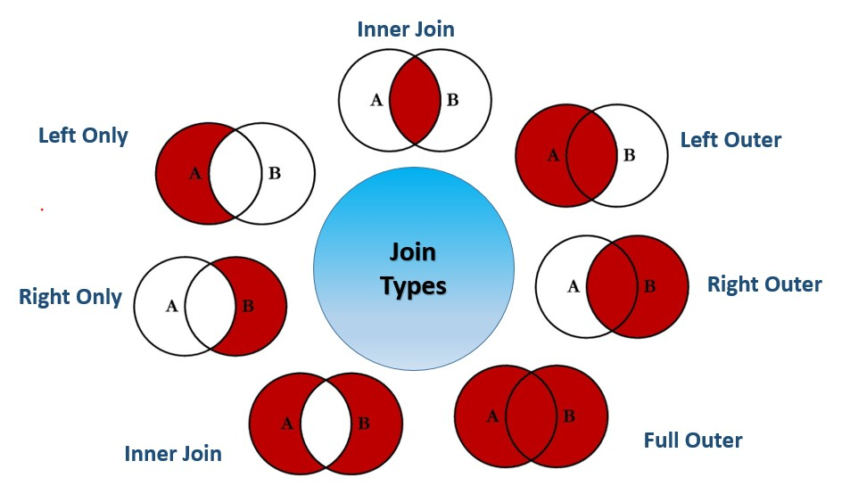

# JOIN

The join function produces a result dataset based on the intersection of two datasets or indexes.

```java

/*** Join with inline Transform ***/
attribName := JOIN(LEFT_DatasetName,
                   RIGHT_DatasetName,
                        // JoinConditions - AND/OR/NOT_Equal
                        LEFT.fieldName  = RIGHT.fieldName AND
                        (LEFT.fieldName = RIGHT.fieldName OR,
                        LEFT.fieldName != RIGHT.fieldName),
                    TRANSFORM(Result_RecordLayout,
                            SELF := LEFT,
                            SELF := RIGHT),
                    JOINType
                    [, flags]);


/*** Join with stand-alone Transform ***/
attribName := JOIN(LEFT_DatasetName,
                   RIGHT_DatasetName,
                        // JoinConditions - AND/OR/NOT_Equal
                        LEFT.fieldName  = RIGHT.fieldName AND
                        (LEFT.fieldName = RIGHT.fieldName OR,
                        LEFT.fieldName != RIGHT.fieldName),
                    xFormName(LEFT, RIGHT),
                    JOINType
                    [, flags]);
```

- attribName
  - The name by which the join will be invoked
- LEFT_DatasetName
  - Left dataset name
- RIGHT_DatasetName
  - Right dataset name
- LEFT.fieldName = RIGHT.fieldName
  - Join condition
    - can use equal (=) or not-equal (!=)
  - multiple conditions can exists using AND/OR
  - Please see below Conditions for additional information
- Transform/xFormName
  - Join, inline or stand-alone transform
  - Please see below Transform for additional information
- JoinType
  - Default is Inner join.
  - Please see below Join Types for available types
- Flags
  - Optional
  - Please see below Flags for additional information

**Condition**

- Boolean test of arbitrary complexity
- Normally contains at least one equality test
- Reference attributes within the input datasets via LEFT and RIGHT - ds1 = LEFT - ds2 = RIGHT

**Transform**

- If using an explicit TRANSFORM, it should accept at least two arguments
  - One representing a LEFT record and the other representing a RIGHT record
  - Ex: BazRec MakeBaz(FooRec rec1, BarRec rec2) := TRANSFORM … END;
- If using an inline TRANSFORM, use LEFT and RIGHT to reference input data

**Flags**

Optional flags that can alter the behavior of the JOIN. Followings are the commonly used flags

- **LOOKUP** The <u>right</u> dataset is relatively small and there should be only <u>one match</u> for any LEFT record
- **ALL** The <u>right</u> dataset is relatively small and can be copied to every node in its entirety
  - Can have multiple matches (unlike LOOKUP)
  - Supports join conditions that contain no equalities
  - Required if there are no equality tests in the condition
- **Few** Specifies the LOOKUP <u>right</u> dataset has few records, so little memory is used
- **NOSORT** Performs the JOIN without dynamically sorting the tables. This implies that the left and/or right recordset must have been previously sorted and partitioned based on the fields specified in the joinCondition
- **KEYED** Specifies using indexed access into the <u>right</u> recordset
- **LOCAL** JOIN performed on each supercomputer node independently, and maintains the pervious distribution of data
- **KEEP(n)** Specifies the maximum number of matching records (n) to generate into the result set. If omitted, all matches are kept.
- **LIMIT** Specifies a maximum number of matching records which, if exceeded, either fails the job, or eliminates all those matches from the result set.

### Join Types

- **INNER**: Keep only those records that exist in both datasets. Default value if no type is listed.
- **LEFT OUTER** Keep all records from LEFT, even if there are no matches.
- **RIGHT OUTER** Keep all records from RIGHT, even if there are no matches.
- **LEFT ONLY** One record for each left record with no match in the right.
- **RIGHT ONLY** One record for each left record with no match in the left.
- **FULL ONLY** One record for each left and right record with no match in the opposite.
- **FULL OUTER** One record for each record in left and right dataset.



<p style="text-align: center"> Employee Information, EmpDS</p>


<p style="text-align: center"> Job Category, JobCatDS</p>


```java
EmpResult_Layout := RECORD
    INTEGER EmpID;
	STRING  Name;
	STRING  Title;
	STRING  Department;
END;


//Inner Join
InnerJoin := JOIN(EmpDS, JobCatDS,
					LEFT.EmpID = RIGHT.EmpID,
					TRANSFORM(EmpResult_Layout,
						SELF := LEFT,
						SELF := RIGHT));

OUTPUT(InnerJoin, NAMED('InnerJoin'));

//LEFT ONLY Join
LeftOnlyJoin := JOIN(EmpDS, JobCatDS,
					LEFT.EmpID = RIGHT.EmpID,
					TRANSFORM(EmpResult_Layout,
							SELF := LEFT,
							SELF := RIGHT),
							LEFT ONLY);

OUTPUT(LeftOnlyJoin, NAMED('LeftOnlyJoin'));

//LEFT OUTER Join
LeftOuterJoin := JOIN(EmpDS, JobCatDS,
						LEFT.EmpID = RIGHT.EmpID,
						TRANSFORM(EmpResult_Layout,
							SELF := LEFT,
							SELF := RIGHT),
							LEFT OUTER);

OUTPUT(LeftOuterJoin, NAMED('LeftOuterJoin'));

```

<p style="text-align: center"> Inner Join Result</p>


<p style="text-align: center"> Left Only Join Result</p>


<p style="text-align: center"> Left Outer Join Result</p>


## Resources

Put it into practice [join.ecl](https://ide.hpccsystems.com/workspaces/share/291d17d9-e5cb-4fac-83c2-ac5997c28a31)

Please see [JOIN Function](https://hpccsystems.com/training/documentation/ecl-language-reference/html/JOIN.html) for more information.
