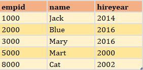
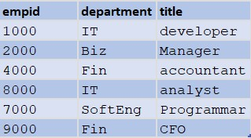
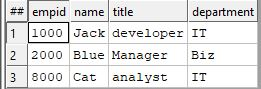
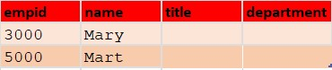
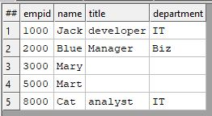

# JOIN

## Quick Look

The join function produces a result set based on the intersection of two datasets or indexes.

```java
attribName := JOIN(LEFT_DatasetName,
                   RIGHT_DatasetName,
				   // fields AND/OR fields that are used to compare datasets
					LEFT.fieldName = RIGHT.fieldName AND
					LEFT.fieldName = RIGHT.fieldName,
					TRANSFORM(Result_RecordLayout,
							SELF := LEFT,
							SELF := RIGHT),
					        JOINType);
```

### Join Types

- INNER: Only those records that exist in both datasets.
- LEFT OUTER: At least one record for every record in the left.
- RIGHT OUTER: At least one record for every record in the right.
- LEFT ONLY: One record for each left record with no match in the left.
- RIGHT ONLY: One record for each left record with no match in the right.
- FULL ONLY: One record for each left and right record with no match in the opposite.

Employee Information, EmpDS\


Job Category, JobCatDS\


```java
EmpResult_Layout := RECORD
    INTEGER EmpID;
	STRING  Name;
	STRING  Title;
	STRING  Department;
END;


//Inner Join
InnerJoin := JOIN(EmpDS, JobCatDS,
					LEFT.EmpID = RIGHT.EmpID,
					TRANSFORM(EmpResult_Layout,
						SELF := LEFT,
						SELF := RIGHT));

OUTPUT(InnerJoin, NAMED('InnerJoin'));

//LEFT ONLY Join
LeftOnlyJoin := JOIN(EmpDS, JobCatDS,
					LEFT.EmpID = RIGHT.EmpID,
					TRANSFORM(EmpResult_Layout,
							SELF := LEFT,
							SELF := RIGHT),
							LEFT ONLY);

OUTPUT(LeftOnlyJoin, NAMED('LeftOnlyJoin'));

//LEFT OUTER Join
LeftOuterJoin := JOIN(EmpDS, JobCatDS,
						LEFT.EmpID = RIGHT.EmpID,
						TRANSFORM(EmpResult_Layout,
							SELF := LEFT,
							SELF := RIGHT),
							LEFT OUTER);

OUTPUT(LeftOuterJoin, NAMED('LeftOuterJoin'));

```

<p align="center">
  <p  align="center"> sample dataset is working </p>
    
</p>


<p align="center"> Sample Dataset </p>


Left Only Join Result\


Left Outer Join Result\


## Resources

Put it into practice [join.ecl](https://ide.hpccsystems.com/workspaces/share/291d17d9-e5cb-4fac-83c2-ac5997c28a31)

Please see [TRANSFORM Function](https://hpccsystems.com/training/documentation/ecl-language-reference/html/JOIN.html) for more information.
