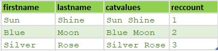

# PROJECT

The PROJECT function processes through all records in the record-set performing the transform function on each record in turn.

```java
nameRec := RECORD //Defining record layout
    STRING firstName;
    STRING lastName;
END;

//creating inline dataset
nameDS := DATASET([
                {'Sun','Shine'},
                {'Blue','Moon'},
                {'Silver','Rose'}],
                nameRec);

//Defining new layout for the project result
nameOutRec := RECORD
    STRING firstName;
    STRING lastName;
    STRING catValues;
    INTEGER recCount; //counter
END;

/*
NameOutRec: result of the project gets saved in this record layout
CatThem: Tranform name
NameRec L: Left datasets that’s passed through project
INTEGER C: counter
*/
nameOutRec catThem(NameRec L, INTEGER C) := TRANSFORM
    SELF.catValues := L.FirstName + ' ' + L.LastName; // concact fname and last name
    SELF.recCount := C; //Counting
    SELF := L; //Assign everything from left recordset
END;

catRecs := PROJECT(nameDS, //Inline dataset, left recordset
                  CatThem(LEFT, COUNTER) //Transform name
                  );
```

Example above result:\


## Resources

Put it into practice [project.ecl](https://ide.hpccsystems.com/workspaces/share/291d17d9-e5cb-4fac-83c2-ac5997c28a31)

Please see [PROJECT Function](https://hpccsystems.com/training/documentation/ecl-language-reference/html/PROJECT.html) for more information.
