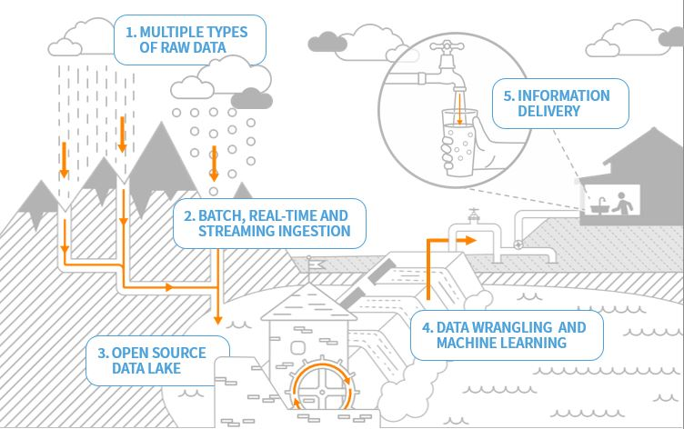
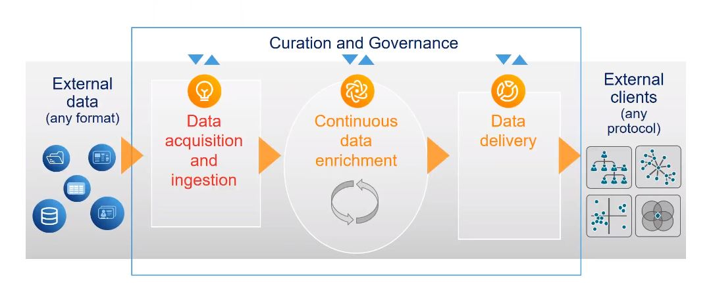

# Data Lake

Data Lake is a centralized repository that allows you to store structured and unstructured data at any scale with low cost. Data lake is a subset of data warehouse, where data comes in, gets cleaned, structured, formatted and packaged for consumption. Data lake can support different types of actions from ETL(Extract, Load, Transform), to analysis, visualization and machine learning.

# HPCC and Data Lake

Data Lake is an architecture and methodology fir continuous management of complex data. More enterprises are accepting data lake technology to manage their internal data, solve complex problems, and improve their relationships with customers and suppliers.

In HPCC Systems, data discovery and experimentation is important and with use of data lake, the path from data discovery to production is short and fast.



**HPCC Systems advantages**

- Open Source Data Lake Platform
- Batch, real time and streaming data ingestion
- built-in data enhancement and machine learning APIs
- Scalable to many petabyte of data
- Increased responsiveness to customer and stakeholders

## Data Lake Overview

Data Lake continuously acquires data from many data sources, both in structured and uninstructed format. Data is usually stored in simple flat files like basic disk files, or in metadata format like Amazon S3.
The process starts with few data sources and some ideas to work on, but these ideas grows over time.
Once data is acquired and ingested the process of data enrichment begins. Data enrichment is an evolving, iterating process to extract as much data possible from data sources. Once the knowledge is extract, it's available to people that need it, which is the start of data delivery phase. During data delivery we make sure that data is transferred in a timely and secure manner.

**Data Curation and Governance**

It is important to have a process for curation; visualization, organizing, and governing the data lake. Data curation is an active and on-going process of data management throughout its life cycle. It is the process of turning independently created data sources into unified data sets ready for user consumption.

Data governance is the process of implementing set of rules and policies to manage and protect data. These policies address issues such as:

- Assigning accountability to employees responsible for data assets
- Granting or restricting per usage and need
- Data privacy and data protection
- Accuracy of data
- Backup plans
- Increasing value of data
- Cost reduction
- Data profiling
- Quality checks
- Addressing SLA (Service Level Agreement)

**Data Swamp**

In contrast with data lake, Data Swamp has little or no curation, including little to no active management throughout the data life cycle. Data swamp contains no or very little data governance or metadata. Metadata can create a tiered storage structure that stops a data lake from turning into a data swamp.



**Data Lake Benefits**

- Enhanced data availability: Promotes continuous value discover.
- Responsive to business needs: Quickly produce production quality data.
- Ease of scaling: Incrementally scale to any capacity.
- Transparency: Visibility into complete process.
- Development efficiency: Removes forced dependencies. The most common reason for project overruns.


## Data Lake Architecture

HPCC Systems Data Lake comprises of three elements: 

The **ECL program** is the application/code that is executed to read, transform and analyze data.

**Thor** is a **batch** processing cluster for ECL programs and data. The Thor executed programs are usually long running (more than a few seconds).

**ROXIE** is a **real-time** API/Query cluster for ECL programs and data. ROXIE programs execute in sub second times and provide for very high concurrency. 

The core design goals for both Thor and Roxie are the same. Both process the data by using a divide and conquer approach. Data is divided into parts and processed in parallel.
[[images/data-parts.png]]

The above is an example of a file with 8 records split into 4 parts with 2 records in each part. Each part is assigned to a process. A 100,000 record file would be split into 4 parts with each part containing 25,000 records.

## ECL
ECL is a [declarative](https://en.wikipedia.org/wiki/Declarative_programming) programming language. The ECL code compiler generates a [data flow graph](https://en.wikipedia.org/wiki/Data_flow_diagram) by interpreting the flow of data within the program. An activity in the graph represents a data operation like a SORT or TRANSFORM. The lines between the activities represent the data that flows between the steps. In addition to the data flow graph, the compiler generates C++ code for each of the activity steps in the graph. The C++ code is compiled to a native DLL. At runtime, Thor or ROXIE interpret the activity graph and execute each step by providing the input to each step, executing the activity and flowing the results of the activity to the next step.   

A simple ECL program:

```ecl
//Read data from employee and salary files
getEmployee := DATASET([{1, 'Mary', 'Peters'}, 
                        {2, 'John', 'Smith'}], 
                        {STRING1 id, STRING25 first, STRING25 last});

getSalary := DATASET([{1, 101000}, {2,99000}], 
                     {STRING1 id, REAL salary});


//Join the two datasets
joinEmployeeAndSalary := JOIN(getEmployee, getSalary, 
                 LEFT.id=RIGHT.id);

//Output the joined datasets
OUTPUT(joinEmployeeAndSalary);
```

[Try the code here](http://play.hpccsystems.com:8010/?Widget=ECLPlaygroundWidget)

...and the ECL programs data flow graph:

 

## Thor

The Thor cluster is based on a master/slave design. Each data partition is processed by a slave process, and a master process manages the slave processes.


### The Middleware

The Middleware are a set of services that manage Thor clusters. They are responsible for: 

* Accepting program requests, coordinating its execution and returning the results.
* Storing the metadata for data stored on the cluster
* Storing execution results
* A management interface to observe the results, start and stop program executions, and manage the cluster components

The Thor middleware components:


A Thor cluster can run on a single compute node or multiple compute node as shown below. 


Production environments should run the middleware services on a separate node (or nodes). This will help in expanding (in the future) the processing capabilities by adding compute nodes to a single cluster or adding multiple clusters. 

ECL programs are executed on Thor by submitting the program code to the ESP service. The following describes the execution flow:


1. The client submits the ECL program to ESP
2. ESP calls Dali to create a workunit entry and embeds the ECL program in the workunit
3. Dali queues a compile job to ECLCC server
4. ECLCC Server de-queues the entry and compiles the ECL program to a DLL
5. After compilation, the ECLCC server updates the workunit entry in Dali by adding the DLL
6. Dali queues the workunit in the Agent queue
7. Agent executor de-queues and creates an ECL Agent to execute the job  
8. If the ECL Agent executes the program, the ECL Agent updates the workunit entry with the results (scenario a). If the ECL Agent determines that it has send it to a Thor cluster, it queues the workunit in the respective Thor's queue (scenario b).
9. The Thor Master de-queues the workunit entry and executes the ECL program
10. The Thor Master updates the Dali workunit entry with the results of the execution

## ROXIE

ROXIE is an API server used to publish real-time data query services. The service can be invoked using SOAP or REST and can be delivered as JSON or XML.


ROXIE based ECL programs can be deployed to ROXIE in a couple of ways:

**Scenario A**

* A-1 ECL Program is submitted for compilation to ESP
* A-2 ESP creates a workunit entry for the ECL Program in Dali
* A-3 Dali queues a compile job to ECLCC Server
* A-4 ECLCC Server de-queues the entry and compiles the ECL program to a DLL
* A-5 After compilation, the ECLCC server updates the workunit entry in Dali by adding the DLL
* A-6 The compiled query is published to a target ROXIE by the client through ESP
* A-7 ESP requests Dali to publish the query
* A-8 Dali publishes the DLL to the target ROXIE
* A-9 The datasets accessed by the ECL program is copied over from the Thor cluster (This can be set to occur when the ROXIE service is requested for the first time)


**Scenario B**

* B-1 ECL Program is compiled to a DLL on the client system and deployed to ROXIE
* B-2 A Package file with the data definitions for the ECL Program is created and copied to ROXIE
* B-3 The datasets accessed by the ECL program is copied over from the Thor cluster 


**Execution**

The deployed ROXIE program creates a wrapper SOAP/REST endpoint. Invoking the end point, initiates the ROXIE Server process to execute the ECL Program by interpreting its data flow graph. The result is immediately returned to the caller.

NOTE: Packages are used to separate data from the code. Therefore, new data can be copied without altering the deployed code.  


A ROXIE cluster can be scaled from a single compute node to 100s. Each compute node runs a single process that consists of three components. The three components share the resources of the process.

The **compiled query service** as a DLL. Hundreds of query services can be deployed to a ROXIE.

The **Server** process accepts client requests, executes the query service and returns the result to the client. One of the important features of the server is to manage the execution of the data flow graph. If it determines a node in a graph requires data, it sends the request to the slave components in the cluster that have the data. The Server communicates to the Slaves via multicast to account for node failures. The Server then collates the data from the slaves and executes the data flow step. Once the entire graph is executed, the Server returns the result to the calling client.

The **Slave** process is mainly responsible for a disk fetch or a single ECL function like a filtered index read. The Slave process receives requests only from a Server process.


