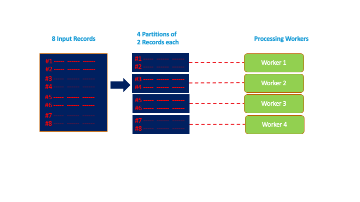
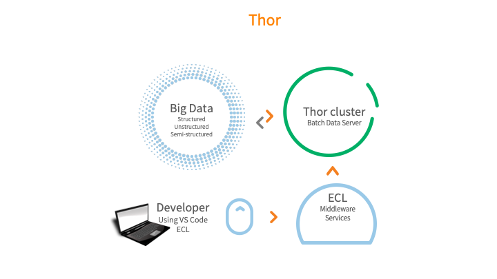
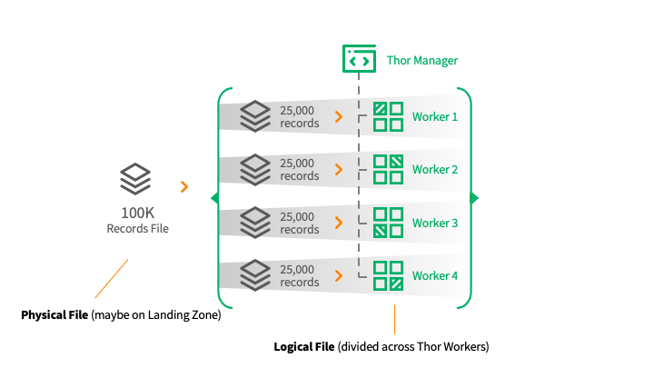
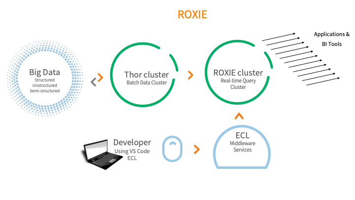
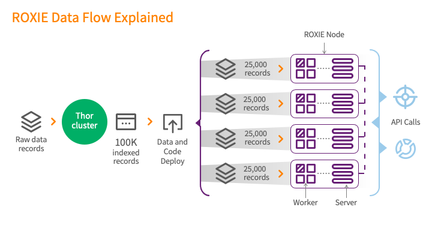

# Data Lake

Data Lake is a centralized repository that allows you to store structured and unstructured data at any scale with low cost. Data lake is a subset of data warehouse, where data comes in, gets cleaned, structured, formatted and packaged for consumption. Data lake can support different types of actions from ETL(Extract, Load, Transform), to analysis, visualization and machine learning.

# HPCC and Data Lake

Data Lake is an architecture and methodology for continuous management of complex data. More enterprises are accepting data lake technology to manage their internal data, solve complex problems, and improve their relationships with customers and suppliers.

In HPCC Systems, data discovery and experimentation is important and with use of data lake, the path from data discovery to production is short and fast.


**HPCC Systems advantages**

- Open Source Data Lake Platform
- Batch, real time and streaming data ingestion
- built-in data enhancement and machine learning APIs
- Scalable to many petabyte of data
- Increased responsiveness to customer and stakeholders

## Data Lake Overview

Data Lake continuously acquires data from many data sources, both in structured and uninstructed format. Data is usually stored in simple flat files like basic disk files, or in metadata format like Amazon S3.
The process starts with few data sources and some ideas to work on, but these ideas grows over time.
Once data is acquired and ingested the process of data enrichment begins. Data enrichment is an evolving, iterating process to extract as much data possible from data sources. Once the knowledge is extract, it's available to people that need it, which is the start of data delivery phase. During data delivery we make sure that data is transferred in a timely and secure manner.

**Data Curation and Governance**

It is important to have a process for curation; visualization, organizing, and governing the data lake. Data curation is an active and on-going process of data management throughout its life cycle. It is the process of turning independently created data sources into unified data sets ready for user consumption.

Data governance is the process of implementing set of rules and policies to manage and protect data. These policies address issues such as:

- Assigning accountability to employees responsible for data assets
- Granting or restricting per usage and need
- Data privacy and data protection
- Accuracy of data
- Backup plans
- Increasing value of data
- Cost reduction
- Data profiling
- Quality checks
- Addressing SLA (Service Level Agreement)

**Data Swamp**

In contrast with data lake, Data Swamp has little or no curation, including little to no active management throughout the data life cycle. Data swamp contains no or very little data governance or metadata. Metadata can create a tiered storage structure that stops a data lake from turning into a data swamp.


**Data Lake Benefits**

- Enhanced data availability: Promotes continuous value discover.
- Responsive to business needs: Quickly produce production quality data.
- Ease of scaling: Incrementally scale to any capacity.
- Transparency: Visibility into complete process.
- Development efficiency: Removes forced dependencies. The most common reason for project overruns.


## Data Lake Architecture

HPCC Systems Data Lake comprises of three elements: 

The **ECL program** is the application/code that is executed to read, transform and analyze data.

**Thor** is a **batch** processing cluster for ECL programs and data. The Thor executed programs are usually long running (more than a few seconds).

**ROXIE** is a **real-time** API/Query cluster for ECL programs and data. ROXIE programs execute in sub second times and provide for very high concurrency. 

The core design goals for both Thor and Roxie are the same. Both process the data by using a divide and conquer approach. Data is divided into parts and processed in parallel.



The above is an example of a file with 8 records split into 4 parts with 2 records in each part. Each part is assigned to a process. A 100,000 record file would be split into 4 parts with each part containing 25,000 records.

## ECL
ECL is a [declarative](https://en.wikipedia.org/wiki/Declarative_programming) programming language. The ECL code compiler generates a [data flow graph](https://en.wikipedia.org/wiki/Data_flow_diagram) by interpreting the flow of data within the program. An activity in the graph represents a data operation like a SORT or TRANSFORM. The lines between the activities represent the data that flows between the steps. In addition to the data flow graph, the compiler generates C++ code for each of the activity steps in the graph. The C++ code is compiled to a native DLL. At runtime, Thor or ROXIE interpret the activity graph and execute each step by providing the input to each step, executing the activity and flowing the results of the activity to the next step.   

A simple ECL program:

```ecl
//Read data from employee and salary files
getEmployee := DATASET([{1, 'Mary', 'Peters'}, 
                        {2, 'John', 'Smith'}], 
                        {STRING1 id, STRING25 first, STRING25 last});

getSalary := DATASET([{1, 101000}, {2,99000}], 
                     {STRING1 id, REAL salary});


//Join the two datasets
joinEmployeeAndSalary := JOIN(getEmployee, getSalary, 
                 LEFT.id=RIGHT.id);

//Output the joined datasets
OUTPUT(joinEmployeeAndSalary);
```

[Try the code here](http://play.hpccsystems.com:8010/?Widget=ECLPlaygroundWidget)

...and the ECL programs data flow graph:

 

## Thor

**What is Thor?**

To define it simply, Thor is like a database server technology. Just like Oracle, MySQL. The main difference is that Thor imports data in bulk and processes data in bulk. For example, let us say you have a file that contains people names and property address. Now, you want to develop a solution that imports this file and then appends the purchase value of the property. You can import this file into Thor, write code to resolve the address, link it to another dataset that might already have the property values and produce the resulting file. Hence, Thor is a database server for processing large amounts of batch data. 

 


**Data Organization in Thor:**



The Thor cluster is based on a **manager** and **worker** design. In effect, you have one manager process and many worker processes. The job of the worker processes is to process one portion or part of an input data file. The manager process acts as the delegator and coordinator of all the workers. 

The reason for this design is rather simple. That is, divide the data in a large file into multiple smaller parts that can then be processed by individual workers that work in parallel.

**Execution of ECL on Thor:**

So when an ECL program is submitted to Thor, the program is compiled into an execution graph that is then deployed to every worker. Every worker and their manager has a replica of this execution graph. The steps in the execution graph that can be individually executed on the partitioned data is delegated to the worker. Steps that need consolidation and coordination are executed by the manager.  

All this is almost identical to how a relational database like Oracle Server behaves. Submitting a SQL statement to Oracle will result in a compile and optimize step that results in an explain plan (we call it an execution graph in HPCC) creation. This plan is then executed by the the database server.

## ROXIE


**What is ROXIE?**

While Thor acts like a Bulk processing Database Server, this data is not easily queryable and retrievable in a concurrent manner. This is because the Thor server is organized around bulk processing. However, once data is processed in Thor this data needs to be made available for querying. This is a very common use. This is why ROXIE was invented. It acts like a query/api server for data that has been processed by Thor. 

 


**Data Organization in ROXIE**

 

While Thor is based on a Manager and Worker design, and while this design works really well for Bulk processing, it is very limited for processing queries. This is because queries are inherently concurrent and need sub second response times. Hence, ROXIE employs a **Server** and **Worker** design. While the workers are similar in function to the Thor worker where the workers process a partition of the data, the ROXIE server acts as 1) a receiver of the query request 2) understands the data partitioning w.r.t workers to fulfill the query request 3) messages all the needed workers for the data 4) consolidates the data and returns the results to the calling process. A single ROXIE cluster can have 1 to many  server and worker combinations. It all depends on how many data partitions make the processing efficient. 

The data partitions are sourced from a Thor cluster as shown in the diagram.

**Execution of ECL on ROXIE:**

The API that is made available via ROXIE is written in ECL and is identical to writing an ECL query in Thor.  Once the query is compiled, it is then published to ROXIE as an end point API. 


