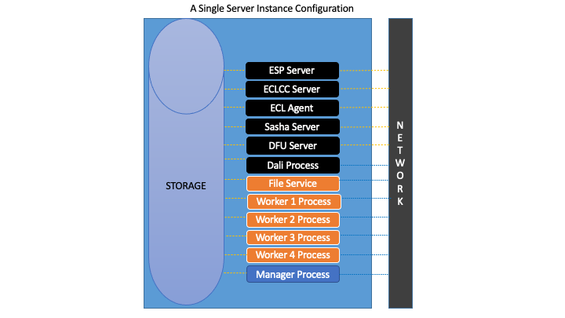
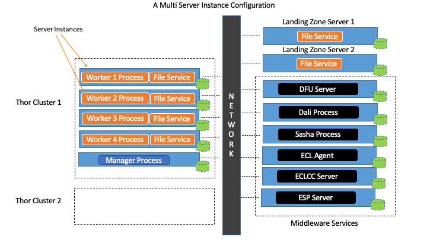
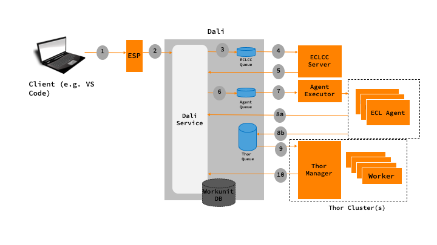
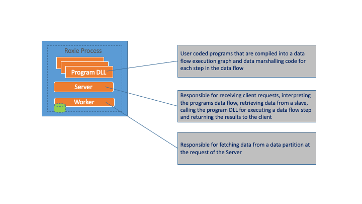
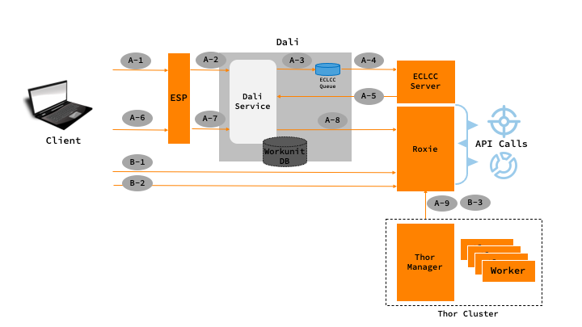

### The Middleware

The Middleware are a set of services that manage Thor clusters. They are responsible for: 

* Accepting program requests, coordinating its execution and returning the results.
* Storing the metadata for data stored on the cluster
* Storing execution results
* A management interface to observe the results, start and stop program executions, and manage the cluster components

## Thor Details Explained:

A Thor cluster can run on a single compute node or multiple compute node as shown below. 

Production environments should run the middleware services on a separate node (or nodes). This will help in expanding (in the future) the processing capabilities by adding compute nodes to a single cluster or adding multiple clusters. 

ECL programs are executed on Thor by submitting the program code to the ESP service. The following describes the execution flow:

1. The client submits the ECL program to ESP
2. ESP calls Dali to create a workunit entry and embeds the ECL program in the workunit
3. Dali queues a compile job to ECLCC server
4. ECLCC Server de-queues the entry and compiles the ECL program to a DLL
5. After compilation, the ECLCC server updates the workunit entry in Dali by adding the DLL
6. Dali queues the workunit in the Agent queue
7. Agent executor de-queues and creates an ECL Agent to execute the job  
8. If the ECL Agent executes the program, the ECL Agent updates the workunit entry with the results (scenario a). If the ECL Agent determines that it has send it to a Thor cluster, it queues the workunit in the respective Thor's queue (scenario b).
9. The Thor Manager de-queues the workunit entry and executes the ECL program
10. The Thor Manager updates the Dali workunit entry with the results of the execution

## ROXIE Details Explained:

A ROXIE cluster can be scaled from a single compute node to 100s. Each compute node runs a single process that consists of three components. The three components share the resources of the process.

The **compiled query service** as a DLL. Hundreds of query services can be deployed to a ROXIE.

The **Server** process accepts client requests, executes the query service and returns the result to the client. One of the important features of the server is to manage the execution of the data flow graph. If it determines a node in a graph requires data, it sends the request to the worker components in the cluster that have the data. The Server communicates to the Worker via multicast to account for node failures. The Server then collates the data from the workers and executes the data flow step. Once the entire graph is executed, the Server returns the result to the calling client.

The **Worker** process is mainly responsible for a disk fetch or a single ECL function like a filtered index read. The Worker process receives requests only from a Server process.

ROXIE based ECL programs can be deployed to ROXIE in a couple of ways:

**Scenario A**

* A-1 ECL Program is submitted for compilation to ESP
* A-2 ESP creates a workunit entry for the ECL Program in Dali
* A-3 Dali queues a compile job to ECLCC Server
* A-4 ECLCC Server de-queues the entry and compiles the ECL program to a DLL
* A-5 After compilation, the ECLCC server updates the workunit entry in Dali by adding the DLL
* A-6 The compiled query is published to a target ROXIE by the client through ESP
* A-7 ESP requests Dali to publish the query
* A-8 Dali publishes the DLL to the target ROXIE
* A-9 The datasets accessed by the ECL program is copied over from the Thor cluster (This can be set to occur when the ROXIE service is requested for the first time)

**Scenario B**

* B-1 ECL Program is compiled to a DLL on the client system and deployed to ROXIE
* B-2 A Package file with the data definitions for the ECL Program is created and copied to ROXIE
* B-3 The datasets accessed by the ECL program is copied over from the Thor cluster 

