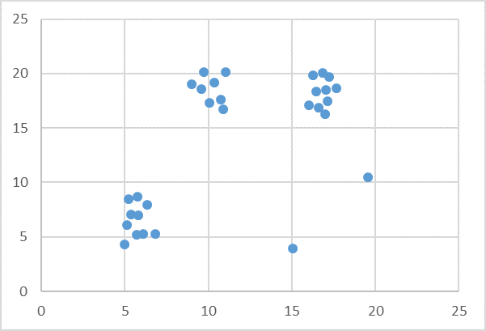

# DBSCAN

This is an example to use DBSCAN model, one of the clustering models in HPCC Systems Machine Learning Library.

The training data used in this example has 30 data points with two outliers, as shown below.

<!--  -->
<p align="center">  </p>
<p align="center"> DBSCAN Sample Dataset </p>

```java

IMPORT ML_Core;
IMPORT ML_Core.Types;
IMPORT DBSCAN;


//Record structure of raw data
Layout := RECORD
  UNSIGNED4 id,
  UNSIGNED4 X,
  DECIMAL Y
END;

//Raw data
raw := DATASET([
                {1,4.965841,4.316708112},
                {2,5.145869,6.074661632},
                {3,5.234874,8.489164326},
                {4,5.364189,7.08132338},
                {5,5.712569,5.2182408486},
                {6,5.745698,8.707510638},
                {7,5.821486,6.998073432},
                {8,6.105629,5.286571686},
                {9,6.320169,7.936895047},
                {10,6.845813,5.297054029},
                {11,9.02356,19.01596},
                {12,9.59856,18.59851},
                {13,9.71489,20.12985},
                {14,10.75121,17.600192},
                {15,10.87142,16.71026},
                {16,10.07634,17.32106},
                {17,10.35716,19.19856},
                {18,11.01537,20.14265},
                {19,16.02369,17.1170699},
                {20,16.44163,18.35488924},
                {21,16.29126,19.80741433},
                {22,16.60159,16.84973988},
                {23,16.86384,20.02797699},
                {24,17.01269,16.24991628},
                {25,17.04156,18.500486546},
                {26,17.15489,17.45414849},
                {27,17.22694,19.70321959},
                {28,17.65487,18.63681562},
                {29,15.05623,3.96452},
                {30,19.58647,10.47025}
                ],  Layout);
OUTPUT(raw, NAMED('raw'));


//Transform raw data to Machine Learning record structure NumericField
ML_Core.ToField(raw, NF);
OUTPUT(NF, NAMED('NF'));


//Train DBSCAN Model
Model := DBSCAN.DBSCAN(3.0, 2).Fit( NF );

//Number of clusters
NumClusters := DBSCAN.DBSCAN().Num_Clusters(Model);
OUTPUT(NumClusters, NAMED('NumClusters'));

//Outliers
NumOutliers :=  DBSCAN.DBSCAN().Num_Outliers(Model);
Outliers := Model(label = 0);
OUTPUT(Outliers, NAMED('Outliers'));

```

## Resources

Put it into practice [DBSCAN.ecl](https://ide.hpccsystems.com/workspaces/share/291d17d9-e5cb-4fac-83c2-ac5997c28a31)

Please visit [DBSCAN](https://hpccsystems.com/blog/DBSCAN) for more details.
