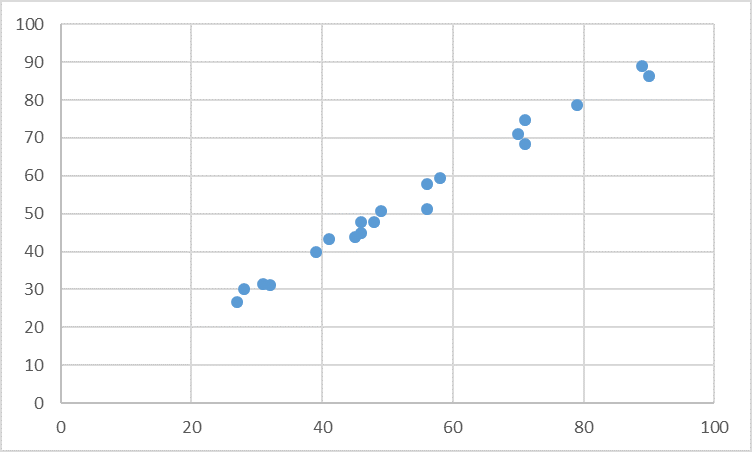

# Decision Tree

This is an example to use Regression Tree model, one of the Decision Tree models in HPCC Systems.

The training data used in this example has 20 data points, as shown below.

<!--  -->
<p align="center">  </p>
<p align="center"> Decision Tree Sample Dataset </p>


```java

IMPORT ML_Core;
IMPORT ML_Core.Types;
IMPORT LearningTrees as LT;

//Record structure of raw data
Layout := RECORD
  UNSIGNED4 id,
  REAL X,
  REAL Y,
END;

//Raw data
raw := DATASET([
              {1,46,47.88388961},
              {2,46,45.00397413},
              {3,32,31.15664574},
              {4,71,74.83135003},
              {5,28,30.23177607},
              {6,56,57.87219151},
              {7,49,50.61728392},
              {8,79,78.67470043},
              {9,90,86.236707},
              {10,89,89.10409255},
              {11,41,43.26595082},
              {12,27,26.68273277},
              {13,58,59.46383041},
              {14,31,31.300416},
              {15,70,71.1433266},
              {16,71,68.4739206},
              {17,39,39.98238856},
              {18,48,47.85817542},
              {19,56,51.20390217},
              {20,45,43.9367213}
             ], Layout);

//Transform to Machine Learning Dataframe, such as NumericField
ML_Core.ToField(raw, NF);
OUTPUT(NF, NAMED('NF'));


// split into input (X) and output (Y) variables
X:= NF(number < 2);
Y :=NF(number = 2);
OUTPUT(X, NAMED('X'));
OUTPUT(Y, NAMED('Y'));

//Training Regression Tree Model
mod := LT.RegressionForest(numTrees:=30, featuresPerNode:=3, maxDepth:=50, nominalFields:=[]).getModel(X, Y);

//Prediction
predict := LT.RegressionForest().predict(mod, X);
OUTPUT(predict, NAMED('predict'));            

```

For more tutorials, please visit [Learning Trees -- A guide to Decision Tree based Machine Learning](https://hpccsystems.com/blog/learning-trees-guide-to-decision-tree-based-machine-learning)