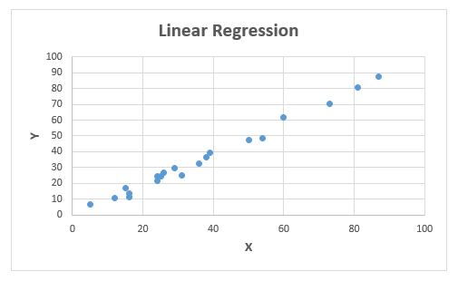

# Linear Regression

Linear regression (scalar approach) is commonly used in predictive analytics. In Linear Regression we look at two things.\
1- Does a set of predictor variables do a good job in predicting an outcome (dependent) variable?\
2- Which variables in particular are significant predictors of the outcome variable?

These regression estimates are used to explain the relationship between one dependent variable and one or more independent variables.

<!--  -->
<p align="center">  </p>
<p align="center"> Linear Regression Sample Dataset </p>

The training data used in the following example has 20 data points, as shown below.
Data point (a row or column) is basically something that defines a certain feature of what you are measuring or studying.\
Please see the details of each step in the comments.

```java

IMPORT ML_Core;
IMPORT ML_Core.Types;
IMPORT LinearRegression AS LROLS;

//Record structure of raw data
Layout := RECORD
  UNSIGNED4 id,
  UNSIGNED4 X,
  DECIMAL Y
END;

//Raw data
raw := DATASET([
                  {1, 24 , 21.54945196},
                  {2, 50 , 47.46446305},
                  {3, 15 , 17.21865634},
                  {4, 38 , 36.58639803},
                  {5, 87 , 87.28898389},
                  {6, 36 , 32.46387493},
                  {7, 12 , 10.78089683},
                  {8, 81 , 80.7633986},
                  {9, 25 , 24.61215147},
                  {10, 5 , 6.963319071},
                  {11, 16 , 11.23757338},
                  {12, 16 , 13.53290206},
                  {13, 24 , 24.60323899},
                  {14, 39 , 39.40049976},
                  {15, 54 , 48.43753838},
                  {16, 60 , 61.69900319},
                  {17, 26 , 26.92832418},
                  {18, 73 , 70.4052055},
                  {19, 29 , 29.34092408},
                  {20, 31 , 25.30895192}
                ],  Layout);
OUTPUT(raw, NAMED('raw'));

//Transform raw data to Machine Learning record structure NumericField
ML_Core.ToField(raw, NF);
OUTPUT(NF, NAMED('NF'));

// split data into input (X) and output (Y) variables
X := NF(number < 2);
Y := NF(number = 2);
OUTPUT(X, NAMED('X'));
OUTPUT(Y, NAMED('Y'));

//Training LinearRegression Model
lr := LROLS.OLS(X, Y);

//Prediction
predict := lr.predict(X);
ML_Core.FromField(predict, layout, result);
OUTPUT(result, NAMED('predictionResult'));

//Evaluate the prediction result with metrics such as R2, MSE and RMSE
eval := ML_Core.Analysis.Regression.Accuracy(predict , y);
OUTPUT(eval, NAMED('Evaluation'));


```
