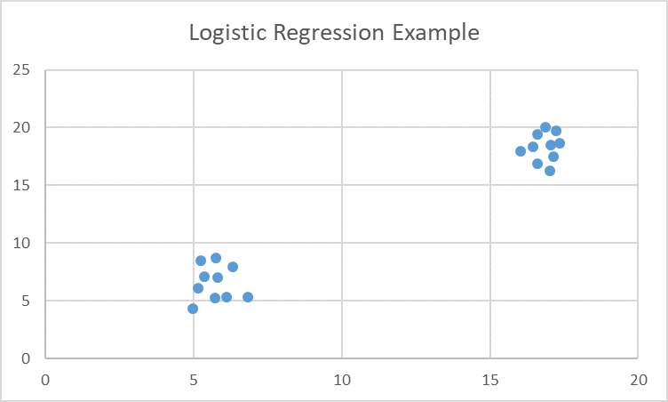

# Logistic Regression

This is an example to use Logistic Regression model in HPCC Systems.

The training data used in this example has 20 data points, as shown below.


<!--  -->
<p align="center">  </p>
<p align="center"> Logistic Regression Sample Dataset </p>

Below is the example ECL code to fit the sample to a logistic regression model.
Please see the details of each step in the comments.

```java

IMPORT ML_Core;
IMPORT ML_Core.Types;
IMPORT LogisticRegression as LR;

//Record structure of raw data
Layout := RECORD
  UNSIGNED4 id,
  REAL X,
  REAL Y,
  UNSIGNED4 label
END;

//Raw data
raw := DATASET([
              {1, 5.712569, 5.218240849, 0},
              {2, 5.364189, 7.08132338 , 0},
              {3, 16.02369, 17.9170699 , 1},
              {4, 16.60159, 16.84973988, 1},
              {5, 4.965841, 4.316708112, 0},
              {6, 5.145869, 6.074661632, 0},
              {7, 6.105629, 5.286571686, 0},
              {8, 5.234874, 8.489164326, 0},
              {9, 6.845813, 5.297054029, 0},
              {10, 5.745698, 8.707510638, 0},
              {11, 17.35487, 18.63681562, 1},
              {12, 6.320169, 7.936895047, 0},
              {13, 17.01269, 16.24991628, 1},
              {14, 17.15489, 17.45414849, 1},
              {15, 5.821486, 6.998073432, 0},
              {16, 16.44163, 18.35488924, 1},
              {17, 16.86384, 20.02797699, 1},
              {18, 17.22694, 19.70321959, 1},
              {19, 17.04156, 18.50048655, 1},
              {20, 16.59126, 19.40741433, 1}
             ], Layout);

//Transform to Machine Learning Dataframe, such as DiscreteField
ML_Core.ToField(raw, NF);
OUTPUT(NF, NAMED('NF'));

// split into input (X) and output (Y) variables
X:= NF(number < 3);
Y := PROJECT(NF(number = 3), TRANSFORM(Types.DiscreteField, SELF.number := 1, SELF := LEFT));
OUTPUT(X, NAMED('X'));
OUTPUT(Y, NAMED('Y'));

//Training LogisticRegression Model
mod_bi := LR.BinomialLogisticRegression(100,0.00001).getModel(X, Y);

//Prediction
predict := LR.BinomialLogisticRegression().Classify(mod_bi, X);
OUTPUT(predict, NAMED('predict'));          

```

For more documentations, please visit [Logistic Regression Documentation](https://cdn.hpccsystems.com/pdf/ml/LogisticRegression.pdf)