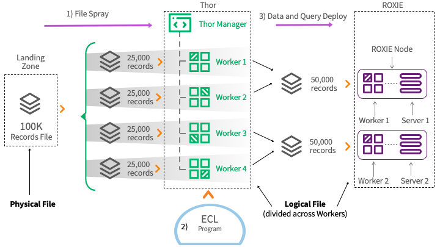
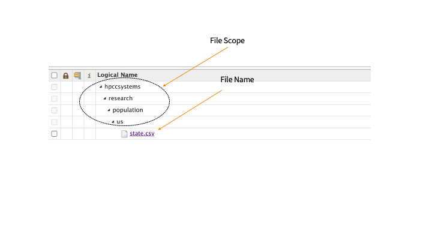
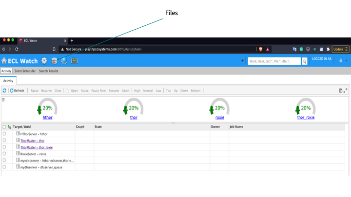
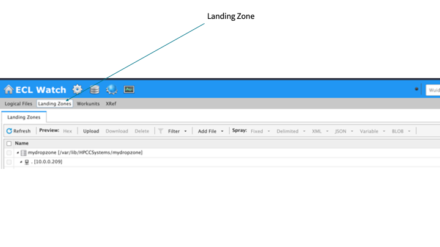
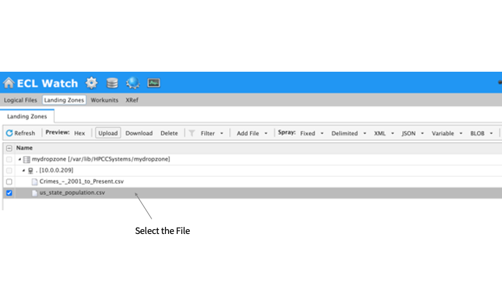
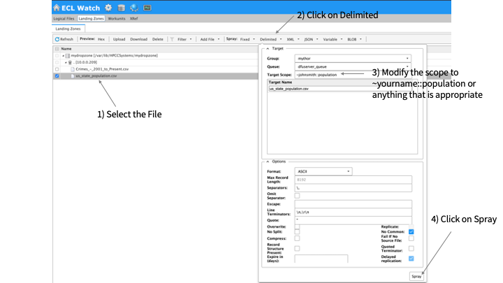
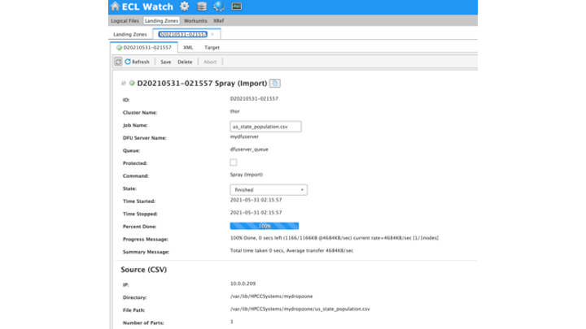
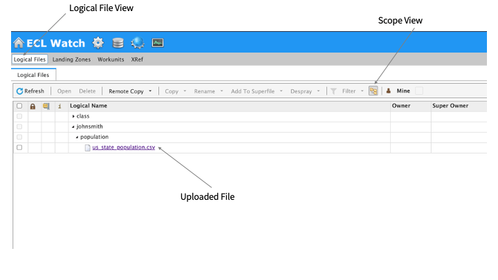

# Data Handling

HPCC Data is stored as Logical Files. A single logical file contains N parts for the N Workers that are configured in Thor or ROXIE. The reason for dividing a file into several parts is accommodate the ability to process data in parallel by each Worker process. 

## Logical File in Thor and ROXIE


NOTE: You will notice in the above diagram the the number of parts in Thor (4 parts) is different from the number of parts in ROXIE (2 parts) even though the data amounts to exactly the same number of total records. This is a practical representation of data is organized in each of the clusters and how data is consolidated if it is moved from one cluster to the other. 

## Lifecycle of a Logical File

The source of data that results in the creation of a logical file typically occurs in one of three ways:



1. Spraying a file : The process by which a physical file is imported into the Thor cluster from the landing zone. 
2. Executing ECL Program: An ECL program typically reads a logical file, applies a transformation and writes another logical file.
3. Deploying a query and/or data to ROXIE (aka publishing): This is when a ROXIE query is compiled and deployed to ROXIE.

## Organizing Logical Files Using Scopes



When you create a logical file within HPCC using one of the methods mentioned in the lifecycle, the file is uniquely identified using a scope part and a name part as shown in the diagram. The scope part is similar to a directory structure definition on a file system. This is represented as the following resource identifier in ECL code:

```java
~hpccsystems::research::population::us::states.csv
```

Where,

"~" : Refers to the root scope. If it is omitted, the root scope will be used as "thor"

"::": Refers to the scope separator. It is like "/" while defining the directory structure. 

## Importing Data in Thor using Spray

In this section, we will go through the process of importing a file into a Thor cluster. The HPCC Systems team has created a publicly available cluster for the purpose of training. The admin interface to the cluster called ECL Watch is available at http://play.hpccsystems.com:8010. 

For this exercise we are going to use the US States population data that is located at:

https://www2.census.gov/programs-surveys/popest/tables/2010-2018/state/asrh/sc-est2018-agesex-civ.csv

Steps to follow:

1. Download the above file to your laptop or desktop
2. Open http://play.hpccsystems.com:8010 in your browser
   


3. Click on the Files menu as shown in the above diagram. While there is a lot to learn about ECL Watch, our focus in this exercise is going to be to use ECL Watch for importing a file into the cluster. Once you are the files section, click on Landing Zone. You should now see the following view:



The Landing Zone is a server or storage service that is accessible to the Thor cluster. It is used for storing files temporarily before importing the file into the Thor cluster.

4. Upload the file from your computer onto the LandingZone by clicking on the 1) Upload button, 2) select the file from your computer, 3) Enter the IP. It should match the landing zone IP 4) Click on the Start button


5. Once the upload is complete, you should see:



Click on the file and select the Row as shown

6. Import the CSV file using Spray Delimited

From earlier, we have learnt that the process of spraying incorporates 1) dividing the input file into as many parts as there are workers configured in the Thor cluster 2) copying the data parts into the Thor cluster.



As indicated in the diagram above:

STEP 1. Select the file to spray
STEP 2. Click on Delimited Spray menu as our source file is a CSV (delimited) file
STEP 3. Modify the scope
STEP 4. Keeping the rest as the default values selected, click on Spray. If everything goes well, you should see something like the following:



NOTE: Please pay special attention to the number of parts field. This will reflect the number of workers on the Thor cluster. 

7. Click on the logical file view to see the file in the list



If you want, you can click on the file to view its contents