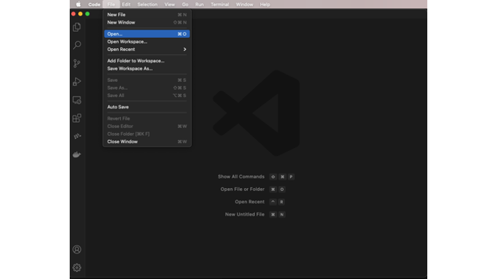
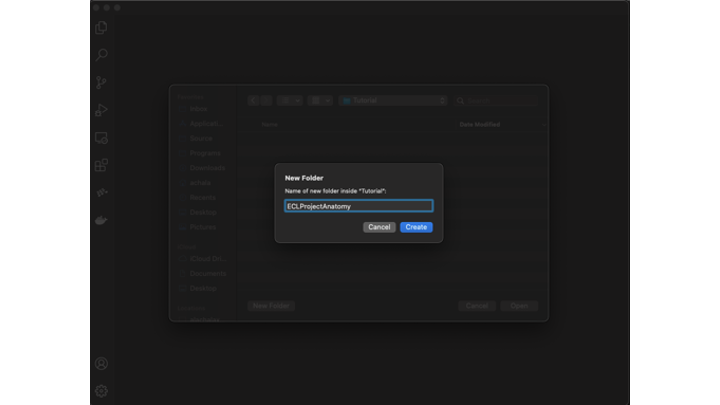
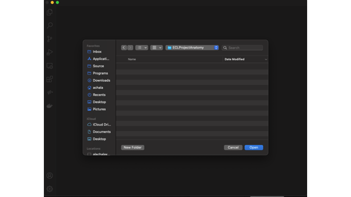
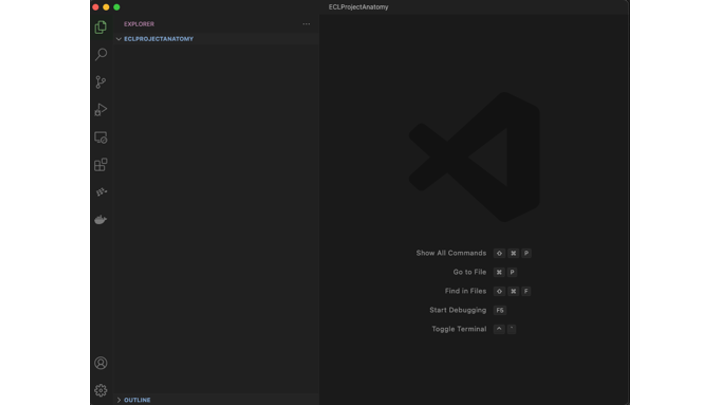
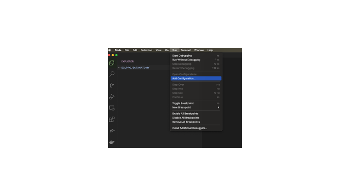
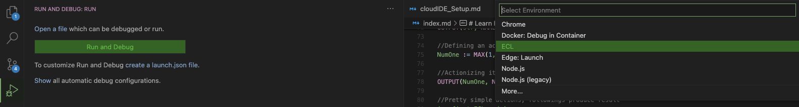
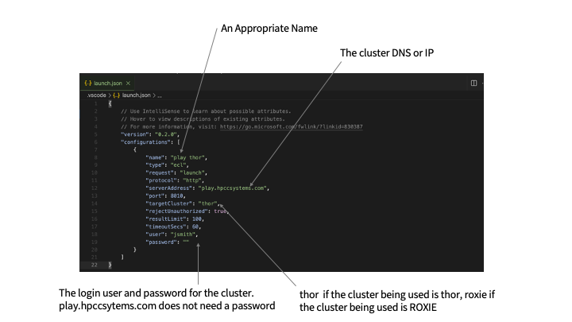

# Anatomy of an ECL Project

A ECL project is a folder that contains a set of related ecl files that can be organized using subfolders. For our example, let us consider a VS Code Project (it is similar in ECL Cloud IDE). 

## Step 1 - For starters, let us create a new project in VS Code:

In VS Code, click on Open

in the dialog box, click on New Folder (wherever you chose to store it on your computer). Enter an appropriate name for your project.

Click on the Open button to create a new project

You should now see an empty project as shown here:

NOTE: This also happens to be the **root folder** of your project. The concept of a root folder is very important in the understanding of the organization of an ECL project. You will learn more of that a little later in this tutorial. 

## Step 2 - Let us setup the ECL Configuration

Click on the VS Code menu Run -> Add Configuration

Select ECL from the list

The ECL Configuration to access the open playground HPCC Systems Cluster

