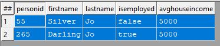
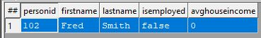

<html lang="en" data-color-mode="auto" data-light-theme="dark" data-dark-theme="dark">

                <a href="https://github.com/hpccsystems-solutions-lab/Learn-ECL/blob/16f6d0374864dae731604adf591ac7bebe8e947f/LearnECL/MainConcepts/filter.md"  target="_blank" style="position: absolute; right:0; z-index:900;">
                    <button type="button" role="presentation" title="Edit this document" aria-label="Edit current document on GitHub" style="padding:5px 20px;cursor:pointer;">Edit</button>
                </a>

# Filter

Data filtering is the process of choosing a smaller part of your data set and using that subset for viewing or analysis. When filtering the complete dataset will remain the same.

## Demo Dataset

|PersonID|FirstName|LastName|isEmployed|avgHouseIncome|
|:----|:---|:---|:----|:---|
102 | Fred | Smith | FALSE | 0
012 | Joe | Blow | TRUE | 11250
085 | Blue | Moon | TRUE | 185000
055 | Silver | Jo | FALSE | 5000
265 | Darling | Jo | TRUE | 5000
333 | Jane | Smith | FALSE | 50000

Filter by income:

Filter by last name and income:

<form method='post' action='https://hpcc-ecl-web-editor.azurewebsites.net/' target='submit' name="ECLCode">

<input type='submit' value="Try It" class="ecl" style="color: black; background-color: #04AA6D; margin-bottom:10px; cursor:pointer;"></input> 

<textarea name='code' class="code">
Layout_Person := RECORD  
    UNSIGNED  PersonID;  
    STRING15  FirstName; 
    STRING25  LastName; 
    BOOLEAN   isEmployed; 
    UNSIGNED  avgHouseIncome;
END; 

allPeople := Dataset('~hthor::samplefile::test::bf::thor', Layout_Person, THOR);
//Show employed people
OUTPUT(allPeople(isEmployed), NAMED('isEmployed'));
//Capture None Smith last names and save the result.
//Strings are case sensitive
noSmith := allPeople(lastName != 'Smith');
OUTPUT(noSmith, NAMED('noSmith'));
//Show income > 100000 or Jo last name
allPeople(lastName = 'Jo' OR avgHouseIncome > 100000);
</textarea>
</form>
</script>

 
 

<a href="#" class="previous">&laquo; Previous</a>
<a href="https://hpccsystems-solutions-lab.github.io/hpcc/LearnECL/MainConcepts/sort" class="next">Next &raquo;</a>

<body>
    
Code Snippet 1
  
    <pre id="code_1">

Layout_Person := RECORD
    UNSIGNED1 PersonID; 
    STRING15 FirstName; 
    STRING25 LastName; 
END; 

    </pre>
    
Code Snippet 2
  
    <pre id="code_2">       

allPeople := DATASET([ {1, 'Fred', 'Smith'}, 
                        {2, 'Joe', 'Blow'}, 
                        {3, 'Jane', 'Smith'}], Layout_Person); 

somePeople := allPeople(LastName='Smith') 

//Outputs
somePeople;
    </pre>

    <button onclick="OpenECLEditor(['code_1', 'code_2'])">Try Me</button> 
</body>