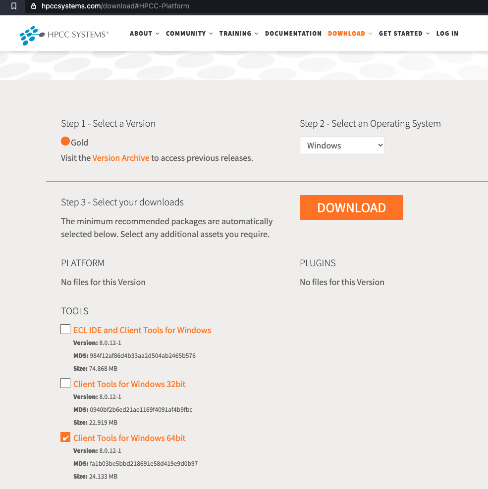
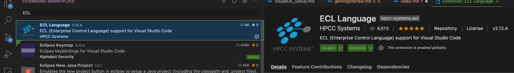
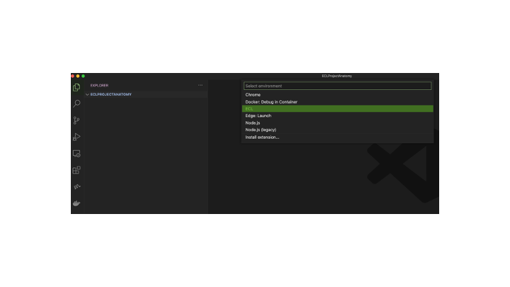

## ECL Cloud IDE

For practicing, you can take advantage of our [ECL Cloud IDE](https://ide.hpccsystems.com/auth/login).

For creating a new account and a quick guide on how to use the Could IDE, use
[instruction manual](/references/cloudide_setup.md)


## VS Code IDE

For advanced use, you are encouraged to install VS Code

1) Download and install https://code.visualstudio.com/
2) Download and install HPCC Client Tools 
   

1) Run VS Code and install the ECL extension 

4) In you ECL project, create an ECL launch script:

5) Initialize the Launch Script (launch.json)
```json
{
    // Use IntelliSense to learn about possible attributes.
    // Hover to view descriptions of existing attributes.
    // For more information, visit: https://go.microsoft.com/fwlink/?linkid=830387
    "version": "0.2.0",
    "configurations": [
        {
            "name": "Play Cluster",
            "type": "ecl",
            "request": "launch",
            "protocol": "http",
            "serverAddress": "play.hpccsystems.com",
            "port": 8010,
            "targetCluster": "thor",
            "rejectUnauthorized": false,
            "resultLimit": 100,
            "timeoutSecs": 60,
            "user": "yourname",
            "password": ""
        }
    ]
}
```
6) If you are running examples that are part of Learn ECL, please ensure you clone

git clone https://github.com/hpccsystems-solutions-lab/Learn-ECL.git

and then open the VS Code project with the SourceCode directory as the root


## Sample Code Access

All sample code is available for download in the SourceCode folder. Or, you can simply access them all to practice and play directly on the

[Cloud IDE workspace ](ttps://ide.hpccsystems.com/workspaces/share/291d17d9-e5cb-4fac-83c2-ac5997c28a31)