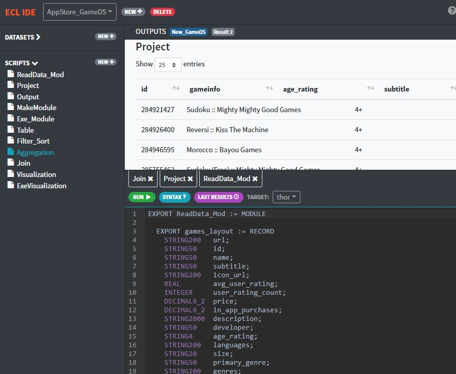

# Getting Started

## HPCC

HPCC System is big data processing platform. Features include high speed processing, near real time result.\
It's functionalities are end to end configuration, scalability, high performance and it includes plugins and extensions for major tools like SQL.

## ECL

Enterprise Control Language (ECL) has been designed specifically for massive data projects using the LexisNexis High Performance Computer Cluster (HPCC). ECL's extreme scalability comes from a design that allows you to leverage
every query you create for re-use in subsequent queries as needed.

Some features of ECL

- Declarative Programming Language
  - In declarative programming you specifies what is to be done rather than how to do it.
- Any Cluster Size
- Source-to-source compiler
- ECL code translated to C++ that is compiled to shared libraries and executed within a custom frame-work

### Two Statement Types

**Definition\Expression**\
Assign an expression to an attribute. Definitions are evaluated.\
Definitions always contain `:=`

`STRING def := 'this is a definition';`\
`INTEGER Num := 900;`

**Action**
Action simple means do something. Actions trigger execution of a workunit that produces
results.

`OUTPUT('this is an action');`\
`SUM(1,2)`

```java
// A simple program

//defining an attribute
str := 'Hello Word';

//puting it into action
OUTPUT(str, NAMED('My_First_Program'));

//Defining an action
NumOne := MAX(1,2,5,6);

//Actionizing it
OUTPUT(NumOne, NAMED('ActionThis'));

//Pretty simple actions, followings produce result
'my first ECL code';
1 + 4 + 5;
2 * 3;

```

## ECL Cloud IDE

For practicing, you can take advantage of our [ECL Could IDE](https://ide.hpccsystems.com/auth/login).

For creating a new account and a quick guide on how to use the Could IDE, use
[this instruction manual](/references/cloudide_setup.md)

<!--  -->

