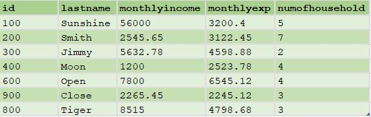

# Mathematics

Let's look at some simple, useful mathematics functions.

someMathDS table\


## SUM

Sum function returns the result of adding numbers together, or returning a sum for a column in dataset.

```java
SUM(1,2,3,4,5) // result is 15
SUM(someMathDS, monthlyIncome) // result is 83958.88
```

## COUNT

Returns the number of occurrence for a specified dataset or value-list.

```java
OUTPUT(COUNT(1,1,2,2,3,5,6), NAMED('SimpleCount')); //returns 7

//num of rows in a dataset
OUTPUT(COUNT(someMathDS), NAMED('ds_Count')); //returns 7

//Count a specific field
OUTPUT(COUNT(someMathDS(numOfHousehold > 3)), NAMED('Count_condition')); //return 4
```

## AVE

The AVE function returns the average value (arithmetic mean) from the specified recordset or the valuelist. It is defined to return zero if the recordset is empty.

```java
OUTPUT(AVE(1,1,2,2,3,5,6), NAMED('SimpleAvg')); //return 2.8571

OUTPUT(AVE(someMathDS, monthlyExp), NAMED('Avg_exp')); //return 3862.0614
```

## MIN

The MIN function either returns the minimum value from the specified recordset or the valuelist. It is defined to return zero if the recordset is empty.

```java
OUTPUT(MIN(1,1,2,2,3,5,6), NAMED('SimpleMin')); //return 1

OUTPUT(MIN(someMathDS, monthlyIncome), NAMED('Min_income')); //return 1200
```

## MAX

The MAX function either returns the maximum value from the specified recordset or the valuelist. It is defined to return zero if the recordset is empty.

```java
OUTPUT(MAX(1,1,2,2,3,5,6), NAMED('SimpleMax')); //return 6

OUTPUT(MAX(someMathDS, monthlyExp), NAMED('Max_exp')); //return 6545.12
```

## TRUNCATE

Returns the integer portion of the real_value.

```java
OUTPUT(TRUNCATE(3.45), NAMED('truncate'));  //return 3

OUTPUT(TRUNCATE(AVE(someMathDS, monthlyExp)), NAMED('truncate_avg')); //return 3862
```

## ROUND

The ROUND function returns the rounded value by using standard arithmetic rounding (decimal portions less than .5 round down and decimal portions greater than or equal to .5 round up).

```java
OUTPUT(ROUND(3.45), NAMED('R1')); // return 3
OUTPUT(ROUND(3.65), NAMED('R2')); //return 4
OUTPUT(ROUND(SUM(someMathDS, monthlyExp)), NAMED('R3')); //return 27034
```

\
Put it into practice [mathematics.ecl](/source/ecl/mathematics.ecl)
