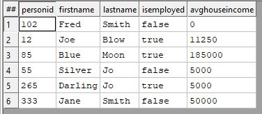
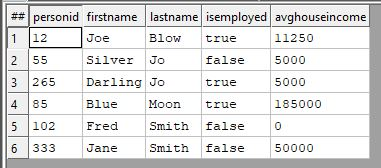
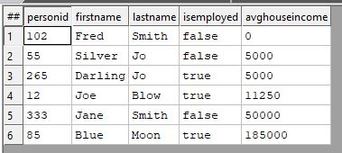

# Sort

Need to sort ascending or descending?

Let's start by defining our dataset.

```java
// Define record layout
Layout_Person := RECORD
  UNSIGNED  PersonID;
  STRING15  FirstName;
  STRING25  LastName;
  BOOLEAN   isEmployed;
  UNSIGNED  avgHouseIncome;
END;

//Inline dataset
allPeople := DATASET([ {102,'Fred','Smith', FALSE, 0},
                       {012,'Joe','Blow', TRUE, 11250},
                       {085,'Blue','Moon', TRUE, 185000},
                       {055,'Silver','Jo', FALSE, 5000},
                       {265,'Darling','Jo', TRUE, 5000},
                       {333,'Jane','Smith', FALSE, 50000}]
											 ,Layout_Person);
OUTPUT(allPeople, NAMED('allPeople'));
```



### Ascending Sort

Sorting from A to Z or 0 to 9.

```Java
A_SortedLastName := SORT(allPeople, LastName);
OUTPUT(A_SortedLastName, NAMED('Asc_SortedLastName'));

A_SortedIncome := SORT(A_SortedLastName, avgHouseIncome);
OUTPUT(A_SortedIncome, NAMED('Asc_SortedIncome'));
```





### Descending Sort

Sorting Z to A or 9 to 0.

```java
D_SortedIncome := SORT(allPeople, -avgHouseIncome);
OUTPUT(D_SortedIncome, NAMED('Des_SortedIncome'));
```


## Resources

Put it into practice [sort.ecl](https://ide.hpccsystems.com/workspaces/share/291d17d9-e5cb-4fac-83c2-ac5997c28a31)
