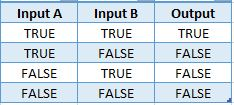
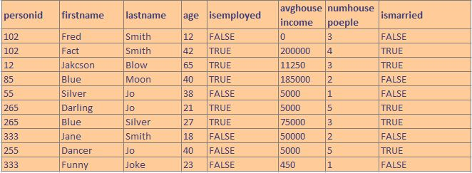
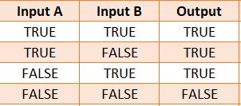
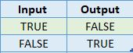

# Logical

## AND

The AND operator is a Boolean operator used to perform a logical conjunction on two expressions. AND operator only returns `TRUE` if both expressions are true. Use parenthesis to identify the order of operation if you have multiple operators together.



allPeople Table


```java
andLogic := allPeople(isMarried = FALSE AND
                               avgHouseIncome > 25000);
```

## OR

The OR operator is a Boolean operator used to perform a logical conjunction on two expressions. OR operator returns `FALSE` only if both expressions are false. Use parenthesis to identify the order of operation if you have multiple operators together.



```java
orLogic := allPeople(isMarried = FALSE OR
                     avgHouseIncome > 75000 OR
                     lastName = 'Joke');
```

## NOT (!=)

The operator accepts a single argument and does the following:

- Converts the operand to BOOLEAN type: true/false.
- Returns the inverse value.



```java
notLogic := allPeople(lastName != 'Jackson');
```

## Complex Logical Operators

When creating complex logics always make sure your rules are not contradicting each other.
For example if you want Silver family not be included in result you need to make sure, your other logics won't include that last name either.\
Sometimes complex logics will result to duplicate rows, in this case `DEDUP` can help.\
For simplicity, you can remove all exclusion first and then continue with your combined logic.
Use of parenthesis can be very helpful to reduce errors in combining wrong logics and readability.

Put it into practice [logicalOperators.ecl](https://ide.hpccsystems.com/#)
