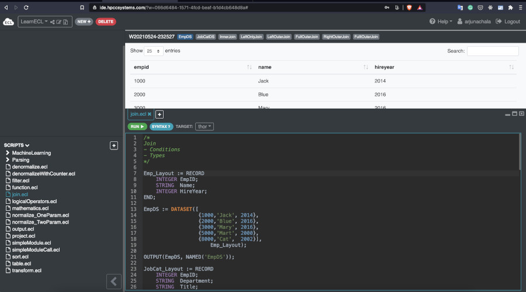

# Learn ECL

Our HPCC Systems Solutions Lab is proud to provide and support ECL tutorials.

Here we introduce basics of HPCC Systems, our big data platform, and a complete tutorial on ECL (Enterprise Control Language).

## HPCC Systems: End to End Data Lake Management

HPCC Systems is a mature platform that has been heavily used in commercial applications for almost two decades, predating the development of Hadoop. Created by LexisNexis® Risk Solutions, an innovative pioneer in big data processing, and open source for nearly a decade now, HPCC Systems features a vibrant development community that continues to push the boundaries of big data.\
This powerful, versatile platform makes it easier for developers to see the data they’re working with and manipulate it as needed. Flexible information delivery makes it easier for your clients to query and find the data they need — and it runs analysis and queries faster than other platforms such as SQL or Hadoop.

**Key Functionalities**

- Standard hardware, operating system and protocols
- High redundancy and availability
- Practical tools and extensions
- Efficient programming
- End-to-end configuration
- Optimized distributed file system (dfs)
- Massive scalability and performance

  ## ECL

  ECL is an easy-to-learn, advanced, and flexible declarative language that was initially developed for complex data scenarios more than 20 years ago and has been tested and refined continuously ever since.\
  ECL has been designed specifically for massive data projects using the LexisNexis Risk Solutions HPCC Systems platform. ECL's extreme scalability comes from a design that allows you to leverage every query you create for re-use in subsequent queries as needed.

* Not case sensitive
* Declarative Programming Language
  - In declarative programming you specifies what is to be done rather than how to do it.
* Can perform on any Cluster Size
* Source-to-source compiler
* ECL code translated to C++ that is compiled to shared libraries and executed within a custom frame-work
* One line comment
  - `//one line only`
* Block comment
  - `/* this is a block comment*/`
* Use of object.property to access dataset fields and definitions.
  - `dataset.fieldName`
  - `moduleName.definition`

### Two Statement Types

**Definition\Expression**

Assign an expression to an attribute. Definitions are evaluated.\
Definitions always contain `:=`

`STRING def := 'this is a definition';`\
`INTEGER Num := 900;`

**Action**
Action simply means "do something." Actions trigger execution of a workunit that produces
results.

`OUTPUT('this is an action');`\
`SUM(1,2)`

```java
// A simple program

//defining an attribute
str := 'Hello Word';

//putting it into action
OUTPUT(str, NAMED('My_First_Program'));

//Defining an action
NumOne := MAX(1,2,5,6);

//Actionizing it
OUTPUT(NumOne, NAMED('ActionThis'));

//Pretty simple actions, followings produce result
'my first ECL code';
1 + 4 + 5;
2 * 3;

```

## ECL Cloud IDE

For practicing, you can take advantage of our [ECL Cloud IDE](https://ide.hpccsystems.com/auth/login).

For creating a new account and a quick guide on how to use the Could IDE, use
[instruction manual](/references/cloudide_setup.md)



## VS Code IDE

For advanced use, you are encouraged to install VS Code

1) Download and install https://code.visualstudio.com/
2) Download and install HPCC Client Tools 

3) Run VS Code and install the ECL extension 

4) In you ECL project, create an ECL launch script:

5) Initialize the Launch Script (launch.json)
```json
{
    // Use IntelliSense to learn about possible attributes.
    // Hover to view descriptions of existing attributes.
    // For more information, visit: https://go.microsoft.com/fwlink/?linkid=830387
    "version": "0.2.0",
    "configurations": [
        {
            "name": "Play Cluster",
            "type": "ecl",
            "request": "launch",
            "protocol": "http",
            "serverAddress": "play.hpccsystems.com",
            "port": 8010,
            "targetCluster": "thor",
            "rejectUnauthorized": false,
            "resultLimit": 100,
            "timeoutSecs": 60,
            "user": "yourname",
            "password": ""
        }
    ]
}
```
6) If you are running examples that are part of Learn ECL, please ensure you clone

git clone https://github.com/hpccsystems-solutions-lab/Learn-ECL.git

and then open the VS Code project with the SourceCode directory as the root


## Code Access

All sample code is available for download in the SourceCode folder. Or, you can simply access them all to practice and play directly on the
[Cloud IDE workspace ](ttps://ide.hpccsystems.com/workspaces/share/291d17d9-e5cb-4fac-83c2-ac5997c28a31).

## Further Training

If you would like further ECL training, please visit
[our training center](https://hpccsystems.com/training) for free online class options.

## Contact Us

Please contact us for questions and feedback:

bahareh.fardanian@lexisnexisrisk.com
