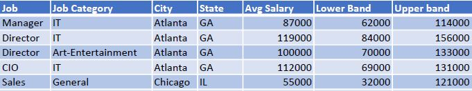

# Record Structure
## Quick Look

Defines the layout o fields in the dataset, order of the fields should be the same as the dataset.



The layout for above dataset would be:

```java
//SalaryAvg is the name of layout.
SalaryAvg := RECORD
    STRING Job;
    STRING Category;
    STRING City;
    STRING2	State;
    INTEGER	Avg Salary;
    INTEGER	LowerBand;
    INTEGER	Upperband;
END;
```
