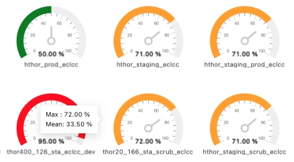
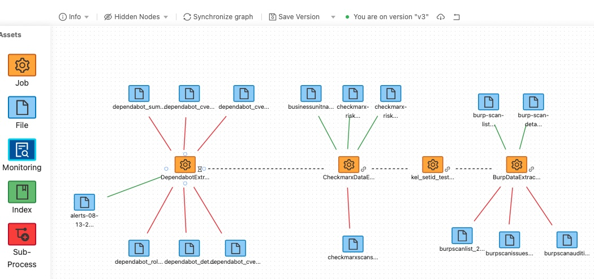

The open source [Tombolo Data Lake Curation](https://github.com/hpcc-systems/Tombolo) offers a comprehensive data catalog solution, primarily designed to optimize the functionality and performance of HPCC Systems clusters. This innovative tool simplifies data management for both technical and non-technical users by providing an intuitive web application interface.

Key features of Tombolo include:

Certainly, here's the enhanced section with the additional information:

**Key features of Tombolo include:**

1. **Design and Import Data Lakes:** Tombolo empowers users to design new Data Lakes or seamlessly import assets from existing HPCC Systems Data Lakes. Whether creating from scratch or enhancing an established structure, Tombolo simplifies documentation by automatically importing data definitions, processing code, and the intricate relationships between files and processing jobs or queries.

2. **Graphical Workflow Mapping:** Tombolo provides a user-friendly interface for visually mapping workflows, suitable for both design and add-on functions. Workflow diagrams effortlessly import data from the Data Lake, and any added processes or jobs are automatically integrated into the diagram, simplifying the process of keeping diagrams up to date. A single refresh button ensures real-time accuracy.

3. **Automation Capabilities:** Automation within Tombolo enables the creation of workflows through scheduled job executions. Users can schedule jobs to run on a recurring basis, trigger them upon the completion of other jobs, or manually execute them within Tombolo. This feature allows entire workflows to be constructed without extensive coding. Tombolo continuously monitors workflow execution, providing notifications in case of failure, and its automation capacity is poised for further expansion in upcoming releases.

4. **Data Governance Support:** While currently offering limited governance support, Tombolo facilitates tracking privacy, proprietary, and contractual constraints on data asset usage, as well as provider-consumer relationship information. Future iterations are set to elevate Tombolo into a comprehensive Data Lake Governance system, enhancing data management and compliance.

5. **Multi-Tenant Support:** Tombolo boasts built-in multi-tenant support, allowing different user groups (tenants) access to distinct Data Lake partitions or separate Data Lakes. Each Data Lake can encompass multiple HPCC-Systems clusters. Tombolo's Access Control currently provides three levels of access for each tenant: read-only, read-write, or tenant administrator. Future releases promise advanced access control, including constraint-based permissions, catering to organizations of varying complexity and scale.

For more information and inquiries, please contact us at **customer-solutions@hpccsystems.com**.

 
For more information and inquiries, please contact us at . customer-solutions@hpccsystems.com.

### Tombolo Images

<figcaption>Tombolo Storage Usage</figcaption>

 
<figcaption>Tombolo Workflow</figcaption>

